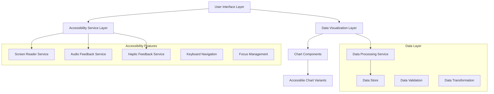

# Design Document

## Overview

HealthVis will be architected as a modular, accessibility-first React application that transforms health data into multiple accessible formats. The design prioritizes semantic HTML, ARIA compliance, and multi-sensory feedback while maintaining a clean, customizable interface. The application will use a component-based architecture with dedicated accessibility services and progressive enhancement patterns.

## Architecture

### High-Level Architecture



### Component Hierarchy

- **App Container**: Main application shell with accessibility context
- **Navigation**: Accessible navigation with skip links and landmarks
- **Dashboard**: Main data visualization area with mode switching
- **Chart Components**: Accessible chart variants (visual, audio, text)
- **Settings Panel**: User preference management
- **Data Input**: Accessible forms for health data entry

## Components and Interfaces

### Core Components

#### 1. AccessibilityProvider
```javascript
// Context provider for accessibility settings and services
interface AccessibilityContext {
  mode: 'visual' | 'audio' | 'hybrid' | 'simplified';
  preferences: UserPreferences;
  announceToScreenReader: (message: string) => void;
  playAudioCue: (type: AudioCueType, data?: any) => void;
  triggerHaptic: (pattern: HapticPattern) => void;
}
```

#### 2. AccessibleChart
```javascript
// Multi-modal chart component
interface AccessibleChartProps {
  data: HealthDataPoint[];
  chartType: 'line' | 'bar' | 'scatter';
  accessibilityMode: AccessibilityMode;
  onDataPointFocus: (point: HealthDataPoint) => void;
}
```

#### 3. DataSonification
```javascript
// Audio representation of data
interface SonificationProps {
  data: HealthDataPoint[];
  playbackRate: number;
  audioMapping: AudioMapping;
}
```

#### 4. ProgressiveDisclosure
```javascript
// Step-by-step data revelation
interface ProgressiveDisclosureProps {
  data: ComplexHealthData;
  currentLevel: number;
  onLevelChange: (level: number) => void;
}
```

### Accessibility Services

#### Screen Reader Service
- Manages ARIA live regions for dynamic announcements
- Provides contextual descriptions for data visualizations
- Handles focus management and navigation announcements

#### Audio Feedback Service
- Sonification engine for data representation
- Audio cues for user interactions
- Text-to-speech integration for data descriptions

#### Keyboard Navigation Service
- Custom keyboard shortcuts for data exploration
- Focus trap management for modal interactions
- Spatial navigation for chart data points

## Data Models

### HealthDataPoint
```javascript
interface HealthDataPoint {
  id: string;
  timestamp: Date;
  value: number;
  unit: string;
  category: 'vitals' | 'symptoms' | 'medication' | 'activity';
  normalRange?: { min: number; max: number };
  description?: string;
  accessibility: {
    audioDescription: string;
    simplifiedValue: string;
    trendIndicator: 'rising' | 'falling' | 'stable';
  };
}
```

### UserPreferences
```javascript
interface UserPreferences {
  visualSettings: {
    fontSize: number; // 12-24px
    contrast: 'normal' | 'high' | 'custom';
    colorScheme: 'light' | 'dark' | 'custom';
    reducedMotion: boolean;
  };
  audioSettings: {
    enableSonification: boolean;
    speechRate: number;
    audioVolume: number;
    preferredVoice?: string;
  };
  interactionSettings: {
    keyboardShortcuts: boolean;
    hapticFeedback: boolean;
    progressiveDisclosure: boolean;
    simplifiedMode: boolean;
  };
}
```

### AccessibilityMode
```javascript
type AccessibilityMode = {
  primary: 'visual' | 'audio' | 'tactile';
  features: {
    screenReader: boolean;
    sonification: boolean;
    hapticFeedback: boolean;
    keyboardOnly: boolean;
    simplifiedUI: boolean;
  };
};
```

## Error Handling

### Accessibility Error Patterns

1. **Screen Reader Errors**: Graceful fallbacks when ARIA features fail
2. **Audio System Errors**: Silent fallback to text descriptions when audio unavailable
3. **Data Loading Errors**: Clear, accessible error messages with retry options
4. **Input Validation Errors**: Immediate, descriptive feedback with correction guidance

### Error Recovery Strategies

- **Progressive Enhancement**: Core functionality works without advanced accessibility features
- **Fallback Modes**: Automatic switching to simpler modes when advanced features fail
- **User Notification**: Clear communication about feature availability and alternatives

## Testing Strategy

### Accessibility Testing Approach

#### Automated Testing
- **axe-core integration**: Automated accessibility rule checking
- **Jest + React Testing Library**: Component accessibility testing
- **Lighthouse CI**: Automated accessibility scoring in CI/CD

#### Manual Testing
- **Screen Reader Testing**: NVDA, JAWS, VoiceOver compatibility
- **Keyboard Navigation**: Tab order, focus management, shortcuts
- **Color Contrast**: WCAG AA/AAA compliance verification
- **Cognitive Load**: User testing with progressive disclosure

#### User Testing
- **Accessibility User Testing**: Testing with blind and visually impaired users
- **Usability Testing**: Task completion and satisfaction metrics
- **Performance Testing**: Ensure accessibility features don't impact performance

### Test Coverage Requirements

1. **Component Accessibility**: All interactive elements have proper ARIA labels
2. **Keyboard Navigation**: All functionality accessible via keyboard
3. **Screen Reader Compatibility**: Meaningful announcements for all actions
4. **Audio Features**: Sonification accuracy and audio cue appropriateness
5. **Progressive Disclosure**: Information hierarchy and navigation clarity

### Testing Tools and Libraries

- **@testing-library/jest-dom**: Accessibility-focused assertions
- **axe-core**: Automated accessibility testing
- **jest-axe**: Jest integration for axe-core
- **Web Audio API**: Testing audio feedback features
- **Mock Service Worker**: Testing with various data scenarios

## Implementation Considerations

### Performance Optimization
- Lazy loading for complex visualizations
- Efficient audio processing for real-time sonification
- Optimized re-rendering for accessibility announcements

### Browser Compatibility
- Web Audio API support for sonification
- Screen Reader API compatibility
- Haptic feedback API availability (mobile)

### Responsive Design
- Touch-friendly targets (44px minimum)
- Scalable text and UI elements
- Adaptive layouts for different screen sizes

### Security and Privacy
- Local storage for user preferences
- No sensitive health data transmission without encryption
- Clear data handling policies for accessibility features