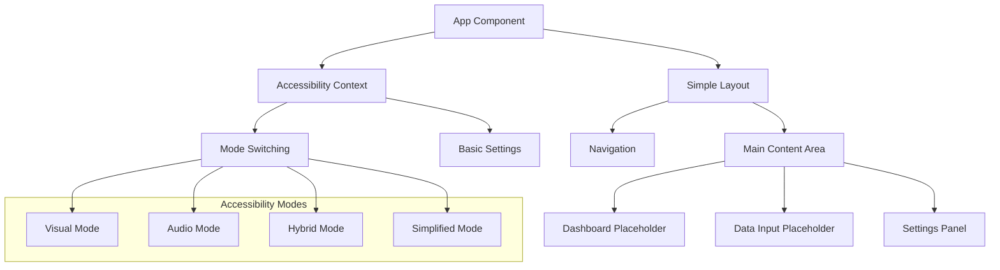

# Design Document

## Overview

The simplified HealthVis will be a lightweight React application focused on accessibility infrastructure and mode switching, with placeholder areas for future data visualization features. The design prioritizes clean, maintainable code with essential accessibility services while avoiding the complexity of the current implementation.

## Architecture

### High-Level Architecture



### Component Structure

The application will have a flat, simple component structure:

- **App**: Main container with accessibility context
- **Layout**: Simple header/main/footer layout
- **Navigation**: Basic navigation with mode selector
- **Dashboard**: Placeholder for future data visualization
- **DataInput**: Placeholder for future data entry
- **Settings**: Basic accessibility preferences
- **ModeSelector**: Switch between accessibility modes

## Components and Interfaces

### Core Components

#### 1. AccessibilityContext
```javascript
// Simplified context for accessibility state
interface AccessibilityContext {
  mode: 'visual' | 'audio' | 'hybrid' | 'simplified';
  settings: {
    fontSize: 'small' | 'medium' | 'large';
    contrast: 'normal' | 'high';
    audioEnabled: boolean;
  };
  setMode: (mode: string) => void;
  updateSettings: (settings: object) => void;
}
```

#### 2. Layout Component
```javascript
// Simple layout with semantic HTML
interface LayoutProps {
  children: React.ReactNode;
  currentPage: string;
}
```

#### 3. ModeSelector Component
```javascript
// Mode switching interface
interface ModeSelectorProps {
  currentMode: string;
  onModeChange: (mode: string) => void;
}
```

#### 4. Settings Component
```javascript
// Basic settings panel
interface SettingsProps {
  settings: AccessibilitySettings;
  onSettingsChange: (settings: object) => void;
}
```

### Accessibility Services

#### Screen Reader Support
- Simple ARIA live regions for announcements
- Proper semantic HTML structure
- Basic focus management

#### Audio Feedback (Audio/Hybrid Modes)
- Simple audio cues for mode switching
- Basic interaction sounds
- Text-to-speech for important announcements

#### Keyboard Navigation
- Tab order management
- Basic keyboard shortcuts (Alt+1, Alt+2, etc.)
- Focus indicators

## Data Models

### AccessibilitySettings
```javascript
interface AccessibilitySettings {
  mode: 'visual' | 'audio' | 'hybrid' | 'simplified';
  fontSize: 'small' | 'medium' | 'large';
  contrast: 'normal' | 'high';
  audioEnabled: boolean;
  keyboardShortcuts: boolean;
}
```

### ApplicationState
```javascript
interface ApplicationState {
  currentPage: 'dashboard' | 'data-input' | 'settings';
  settings: AccessibilitySettings;
  isLoading: boolean;
}
```

## Mode-Specific Behaviors

### Visual Mode
- Standard visual interface
- Full color and styling
- Visual focus indicators
- Standard font sizes

### Audio Mode
- Enhanced screen reader support
- Audio cues for all interactions
- Simplified visual design
- Larger touch targets

### Hybrid Mode
- Combination of visual and audio features
- Both visual and audio feedback
- Balanced interface complexity
- Flexible interaction methods

### Simplified Mode
- Minimal visual complexity
- Larger fonts and buttons
- High contrast colors
- Reduced cognitive load

## Error Handling

### Simple Error Patterns
1. **Settings Errors**: Basic error messages for preference saving failures
2. **Mode Switching Errors**: Graceful fallback to previous mode
3. **Audio Errors**: Silent fallback when audio features unavailable

### Error Recovery
- Clear error messages with simple language
- Automatic fallback to working features
- User notification of feature availability

## Testing Strategy

### Simplified Testing Approach

#### Component Testing
- Basic React Testing Library tests for each component
- Accessibility testing with jest-axe
- Keyboard navigation testing

#### Integration Testing
- Mode switching functionality
- Settings persistence
- Basic user workflows

#### Manual Testing
- Screen reader compatibility (basic)
- Keyboard navigation
- Mode switching behavior

### Test Coverage Goals
1. All interactive elements have proper ARIA labels
2. Keyboard navigation works for all functionality
3. Mode switching updates interface appropriately
4. Settings persist correctly
5. Error states display helpful messages

## Implementation Considerations

### Simplicity Goals
- Maximum 10 components total
- Single context for all state management
- Minimal external dependencies
- Clear, readable code structure

### Performance
- No complex audio processing
- Simple CSS transitions
- Efficient re-rendering
- Local storage for settings only

### Browser Support
- Modern browsers only
- Basic Web Audio API for simple sounds
- Standard localStorage for persistence
- No complex polyfills

### File Structure
```
src/
├── components/
│   ├── Layout.js
│   ├── Navigation.js
│   ├── ModeSelector.js
│   ├── Dashboard.js
│   ├── DataInput.js
│   └── Settings.js
├── context/
│   └── AccessibilityContext.js
├── hooks/
│   ├── useAudio.js
│   └── useKeyboard.js
├── styles/
│   └── App.css
└── App.js
```

This simplified structure maintains essential accessibility features while being much easier to understand and modify than the current complex implementation.